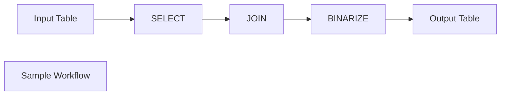
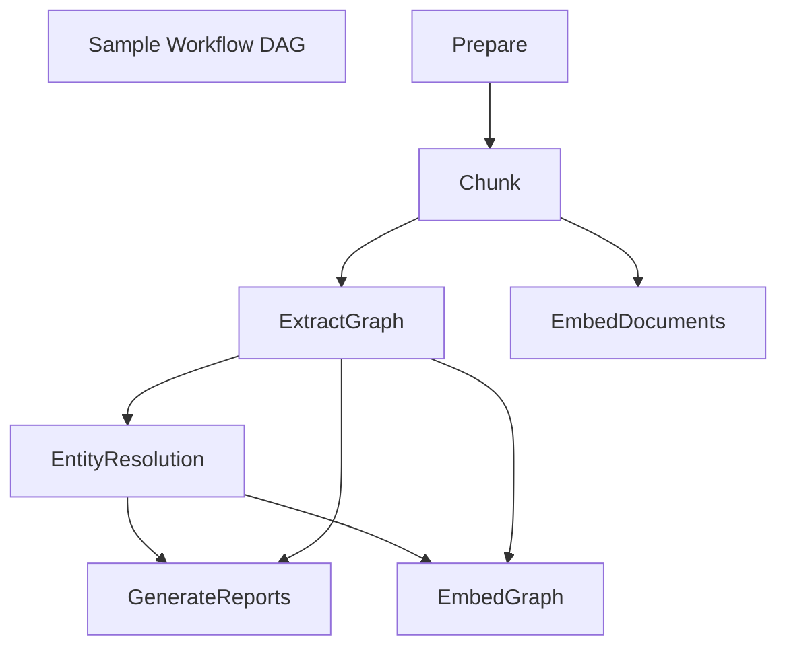

GraphRAG 是一种结构化的层次化检索增强生成（RAG）方法。它通过从原始文本中提取知识图谱，建立社区层次结构，为这些社区生成摘要，并在RAG任务中利用这些结构。GraphRAG相较于传统的基于向量相似性的RAG方法，在处理复杂信息和大型数据集时表现出显著的性能提升。主要过程包括将输入语料切分为文本单元，提取实体和关系，进行层次聚类，并生成社区摘要。在查询时，使用这些结构增强LLM的回答能力。

## GraphRAG vs Baseline RAG 🔍

检索增强生成（RAG）是一种利用现实世界信息来改进LLM输出的技术。这种技术是大多数基于LLM的工具的重要组成部分，大多数 RAG 方法使用向量相似性作为搜索技术，我们称之为基准 RAG。GraphRAG 使用知识图谱在处理复杂信息时提供了显著的问答表现改进。RAG 技术已经显示出在帮助LLMs推理私有数据集方面很有前景 - 这些数据是LLM没有接受过训练并且从未见过的，比如企业的专有研究、商业文件或通信。基准 RAG 是为了帮助解决这个问题而创建的，但我们观察到基准 RAG 在某些情况下表现非常糟糕。例如：
- 基准 RAG 难以连接各个要点。当回答问题需要通过它们共享的属性遍历不同的信息片段，以提供新的综合见解时，就会出现这种情况
- 基线 RAG 在被要求全面理解大数据集或甚至单个大型文档中总结的语义概念时表现不佳。

为了解决这个问题，技术社区正在努力开发扩展和增强 RAG 的方法。微软研究的新方法 GraphRAG 使用LLMs创建基于输入语料库的知识图。这个图，连同社区摘要和图机器学习输出，被用来在查询时增强提示。GraphRAG 在回答上述两类问题方面显示出了显著的改进，展示了超越先前应用于私有数据集的其他方法的智能或精通。

## The GraphRAG Process 🤖  

GraphRAG 基于我们之前使用图机器学习进行的研究和工具开发。GraphRAG 流程的基本步骤如下：
### Index 索引

- Slice up an input corpus into a series of TextUnits, which act as analyzable units for the rest of the process, and provide fine-grained references ino our outputs.  
    将输入语料库切分成一系列 TextUnits，这些 TextUnits 作为可分析单元用于后续过程，并在输出中提供细粒度的参考信息。
- Extract all entities, relationships, and key claims from the TextUnits using an LLM.  
    从 TextUnits 中提取所有实体、关系和关键声明，使用LLM。
- Perform a hierarchical clustering of the graph using the [Leiden technique](https://arxiv.org/pdf/1810.08473.pdf). To see this visually, check out Figure 1 above. Each circle is an entity (e.g., a person, place, or organization), with the size representing the degree of the entity, and the color representing its community.  
    使用 Leiden 技术对图进行分层聚类。要以视觉方式查看，请查看上面的图 1。每个圆圈都是一个实体（例如，一个人、地方或组织），其大小表示实体的程度，颜色表示其社区。
- Generate summaries of each community and its constituents from the bottom-up. This aids in holistic understanding of the dataset.  
    从底层开始生成每个社区及其成员的摘要。这有助于全面理解数据集。

### Query 查询

At query time, these structures are used to provide materials for the LLM context window when answering a question. The primary query modes are:  
在查询时，这些结构用于在回答问题时为LLM上下文窗口提供材料。主要查询模式包括：

- [_Global Search_](https://microsoft.github.io/graphrag/posts/query/0-global_search) for reasoning about holistic questions about the corpus by leveraging the community summaries.  
    全球搜索，利用社区摘要来推理有关语料库的整体问题。
- [_Local Search_](https://microsoft.github.io/graphrag/posts/query/1-local_search) for reasoning about specific entities by fanning-out to their neighbors and associated concepts.  
    通过向其邻居和相关概念扩散来推理特定实体的本地搜索。

### Prompt Tuning 快速调整

Using _GraphRAG_ with your data out of the box may not yield the best possible results. We strongly recommend to fine-tune your prompts following the [Prompt Tuning Guide](https://microsoft.github.io/graphrag/posts/prompt_tuning/overview/) in our documentation.  
使用 GraphRAG 与您的数据开箱即用可能不会产生最佳结果。我们强烈建议根据我们文档中的提示调整指南对您的提示进行微调。

## Index
### Key Concepts
为了支持 GraphRAG 系统，索引引擎的输出（在默认配置模式下）被对齐到我们称之为 GraphRAG 知识模型的知识模型。该模型旨在是对底层数据存储技术的抽象，并为 GraphRAG 系统提供一个通用接口进行交互。在正常的使用情况下，GraphRAG 索引器的输出将被加载到数据库系统中，GraphRAG 的查询引擎将使用知识模型数据存储类型与数据库进行交互。
### DataShaper Workflows 数据整形工作流

GraphRAG 的索引管道是建立在我们的开源库 DataShaper 之上的。DataShaper 是一个数据处理库，允许用户使用明确定义的模式声明性地表达数据管道、模式和相关资产。DataShaper 在 JavaScript 和 Python 中有实现，并且设计为可扩展到其他语言。

DataShaper 中的核心资源类型之一是工作流。工作流以步骤序列的形式表达，我们称之为动词。每个步骤都有一个动词名称和一个配置对象。在 DataShaper 中，这些动词模拟关系概念，如 SELECT、DROP、JOIN 等。每个动词都会转换输入数据表，然后将该表传递到管道中。

### LLM-based Workflow Steps
GraphRAG 的索引管道在我们的 DataShaper 库提供的标准关系动词之上实现了一些自定义动词。这些动词使我们能够利用 GPT-4 等技术的强大功能，为文本文档增加丰富的结构化数据。我们在标准工作流程中使用这些动词来提取实体、关系、声明、社区结构以及社区报告和摘要。( entities, relationships, claims, community structures, and community reports and summaries.)这种行为是可定制的，并且可以扩展以支持许多种基于人工智能的数据丰富和提取任务。
### Workflow Graphs 工作流程图
由于我们数据索引任务的复杂性，我们需要能够将数据管道表达为一系列多个相互依赖的工作流。在 GraphRAG 索引管道中，每个工作流可能定义对其他工作流的依赖关系，有效地形成一个有向无环图（DAG）的工作流，然后用于调度处理。

### Dataframe Message Format
通信工作流程和工作流程步骤之间的主要单元是 `pandas.DataFrame` 的实例。虽然可能存在副作用，但我们的目标是以数据为中心和以表为中心的方式处理数据。这使我们能够轻松地推理我们的数据，并利用基于数据框架的生态系统的强大功能。我们的基础数据框架技术可能随时间变化，但我们的主要目标是支持 DataShaper 工作流程模式，同时保留单机易用性和开发人员人体工程学。
### LLM Caching
GraphRAG 库是以LLM互动为设计目标的，与LLM API 一起工作时常见的问题是由于网络延迟、限流等原因导致各种错误。由于存在这些潜在的错误情况，我们在LLM互动周围添加了缓存层。当使用相同的输入集（提示和调整参数）进行完成请求时，如果存在缓存结果，我们将返回缓存结果。这使得我们的索引器更具抗干扰性，可以幂等地运行，并提供更高效的最终用户体验。
## Prompt Tuning

### Automatic Templating
GraphRAG 提供了创建领域自适应模板以生成知识图的能力。这一步骤是可选的，但强烈建议运行它，因为在执行索引运行时会产生更好的结果。

模板是通过加载输入生成的，将它们分割成块（文本单元），然后运行一系列LLM调用和模板替换来生成最终提示。我们建议使用脚本提供的默认值，但在本页中，您将找到每个值的详细信息，以便进一步探索和调整模板生成算法。

### Manual Prompt Tuning

GraphRAG 索引器默认情况下将使用一些旨在在知识发现的广泛背景下良好运行的提示。然而，通常希望调整提示以更好地适应您的特定用例是很常见的。我们通过允许您指定自定义提示文件来提供这种方式，每个文件将在内部使用一系列令牌替换。

每个提示都可以通过编写纯文本的自定义提示文件来覆盖。我们使用 `{token_name}` 形式的令牌替换，可在下面找到可用令牌的描述。

## Query
查询引擎是图形 RAG 库的检索模块。它是图形 RAG 库的两个主要组件之一，另一个是索引管道（请参见索引管道）。它负责以下任务：

### Local Search
本地搜索方法通过将 AI 提取的知识图谱中的相关数据与原始文档的文本块相结合来生成答案。这种方法适用于需要理解文档中特定实体的问题（例如，洋甘菊的疗效是什么？）。
#### Entity-base Reasoning
本地搜索方法将知识图谱中的结构化数据与输入文档中的非结构化数据相结合，以在查询时增强LLM上下文中的相关实体信息。它非常适合回答需要理解输入文档中提到的特定实体的问题（例如，“洋甘菊有哪些疗效？”）。
#### Methodology

给定用户查询以及可选的对话历史，本地搜索方法识别出一组与用户输入在语义上相关的知识图中的实体。这些实体作为进入知识图的访问点，使得可以提取进一步相关细节，如连接的实体、关系、实体协变量和社区报告。此外，它还从原始输入文档中提取与识别实体相关联的相关文本块。然后对这些候选数据源进行优先排序和过滤，以适应预定义大小的单个上下文窗口，该窗口用于生成对用户查询的响应

### Global Search
全局搜索方法通过以 map-reduce 方式搜索所有 AI 生成的社区报告来生成答案。这是一种资源密集型的方法，但通常对需要全面了解数据集的问题提供良好的响应（例如，这本笔记本中提到的草药的最重要价值是什么？）。

#### Whole Dataset Reasoning
基准 RAG 在处理需要跨数据集聚合信息以组成答案的查询时遇到困难。例如，“数据中前 5 个主题是什么？”这样的查询表现糟糕，因为基准 RAG 依赖于对数据集中语义相似文本内容的向量搜索。查询中没有任何内容指导它找到正确的信息。
然而，通过 GraphRAG，我们可以回答这类问题，因为LLM生成的知识图的结构告诉我们关于数据集整体结构（以及主题）的信息。这使得私有数据集可以被组织成有意义的语义聚类，并进行预摘要。使用我们的全局搜索方法，LLM在回应用户查询时使用这些聚类来总结这些主题。
#### Methodology

给定用户查询和可选的对话历史，全局搜索方法使用来自图的社区层次结构指定级别的LLM个生成的社区报告集合作为上下文数据，以map-reduce的方式生成响应。在 `map` 步骤中，社区报告被分割成预定义大小的文本块。然后，每个文本块用于生成包含一系列点的中间响应，每个点都附带一个表示该点重要性的数值评分。在 `reduce` 步骤中，从中间响应中筛选出最重要的点集合，并将其聚合并用作生成最终响应的上下文

Global searach的响应质量可能会受到选择用于获取community报告的community层次结构水平的影响。较低层次的层次结构，以其详细报告，往往会产生更彻底的响应，但也可能会增加生成最终响应所需的时间和资源，因为report的数量。

### Question Generation
此功能接收用户查询列表并生成下一个候选问题。这对于在对话中生成后续问题或为调查员生成问题列表以深入研究数据集非常有用。

####  Entity-based Question Generation
问题生成方法将知识图谱中的结构化数据与输入文档中的非结构化数据相结合，生成与特定实体相关的候选问题。

#### Methodology
给定一组先前用户问题列表，问题生成方法使用了本地搜索中采用的相同上下文构建方法，以提取和优先考虑相关的结构化和非结构化数据，包括实体、关系、协变量、社区报告和原始文本块。然后，这些数据记录被整合到一个LLM提示中，以生成代表数据中最重要或紧急信息内容或主题的候选后续问题。
